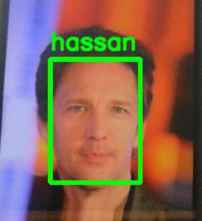
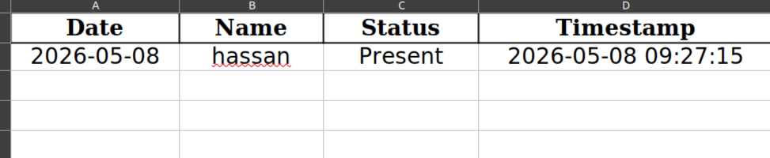

# Smart Attendace System (Version 1)

## Description 
### The problem we can find in schools or companies is managing students or employers manually is very classic and time-consuming. That's why for solving this problem, I create a project titled "Smart Attendance System" that uses Deep Learning models to detected your face and recorded your attendance.  

## About project 
 
### This project powered by a ready deep learning model called "yunet" 
### The working process of this project is as follows: 
- ### The user must be in front of camera 
- ### User faces detect by model 
- ### If user faces picture in the database, an attendance is recorded in excel 

### Key features: 
- ### High precision model: for medium level pictures, 0.86% accuracy was recorded
- ### Runs with minimal hardware resources: you can run this project with CPU

### Requirements: 
- ### Python (3.8 or higher) 

### Installation 
- ### Clone the project: 
    ```bash 
    git clone https://github.com/amirmohammadgholampour/Smart-Attendance-System.git 
- ### Go on the project directory: 
    ```bash 
    cd Smart-Attendance-System
- ### Create a virtual environment: 
    ```bash 
    python3 -m venv venv 
- ### Activate the venv: 
    - #### If you on linux: 
        ```bash 
        source venv/bin/activate
    - #### If you on windows (run on CMD): 
        ```bash 
        venv\Scripts\activate
- ### Install are requirements: 
    ```bash 
    pip install requirements.txt
- ### Run the project: 
    ```bash 
    cd src
    python main.py